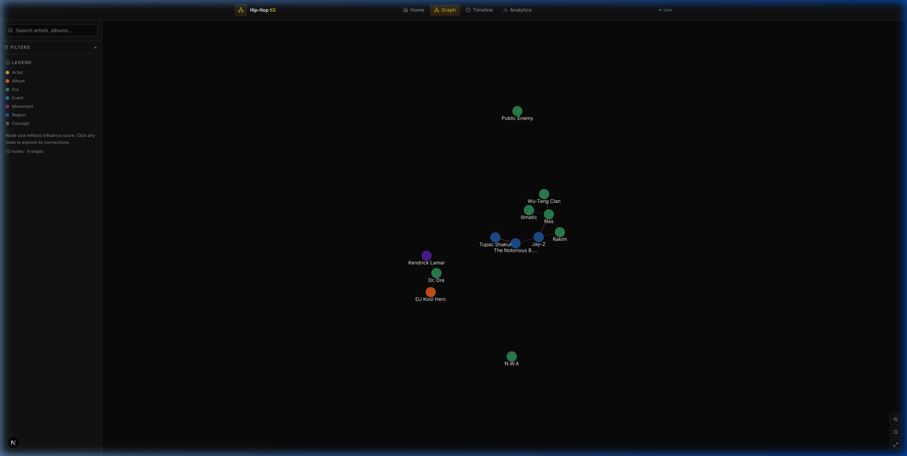

# Hip-Hop Knowledge Graph

A visual journey through the history of hip-hop. This application explores the connections between artists, albums, eras, and influences using a dynamic knowledge graph.



## 🌟 Key Features

- **Interactive Knowledge Graph**: Explore nodes (Artists, Albums, Eras) and their relationships (Influences, Collaborations, Production).
- **Analytics Dashboard**: Gain insights into node distribution, influence scores, and era-specific trends.
- **Eras & Timeline**: Navigate through distinct periods of hip-hop history, from the Roots to the Modern Era.
- **Search & Filter**: Quickly find specific artists or filter the graph by node type and era.
- **Mock Data Fallback**: Robust development experience with a full mock dataset that kicks in if the database is disconnected.

## 🚀 Tech Stack

- **Framework**: [Next.js 16](https://nextjs.org/) (App Router)
- **Language**: [TypeScript](https://www.typescriptlang.org/)
- **Database**: [PostgreSQL](https://www.postgresql.org/) (via Neon Serverless)
- **Caching**: [Redis](https://redis.io/) (via Upstash)
- **Graph Engine**: [react-force-graph-2d](https://github.com/vasturiano/react-force-graph)
- **UI Components**: [Radix UI](https://www.radix-ui.com/), [Lucide React](https://lucide.dev/)
- **Styling**: [Tailwind CSS 4](https://tailwindcss.com/)
- **Charts**: [Recharts](https://recharts.org/)
- **Data Fetching**: [SWR](https://swr.vercel.app/)

## 🛠️ Getting Started

### Prerequisites

- Node.js 20+
- pnpm or npm
- (Optional) PostgreSQL and Redis instances (Mock data fallback enabled by default)

### 1. Clone the repository

```bash
git clone https://github.com/Samiu1/v0-hip-hop-knowledge-graph.git
cd v0-hip-hop-knowledge-graph
```

### 2. Install dependencies

```bash
npm install
# or
pnpm install
```

### 3. Environment Setup

Create a `.env` file in the root directory:

```env
DATABASE_URL=your_neon_postgres_url
UPSTASH_REDIS_REST_URL=your_upstash_redis_url
UPSTASH_REDIS_REST_TOKEN=your_upstash_token
```

*Note: If these variables are not provided, the application will automatically enter "Demo Mode" using high-fidelity mock data.*

### 4. Run the development server

```bash
npm run dev
```

Open [http://localhost:3000](http://localhost:3000) with your browser to see the result.

## 🏗️ Architecture

```
├── app/                  # Next.js App Router routes
│   ├── api/              # API endpoints (Graph, Search, Analytics)
│   ├── (dashboard)/      # Dashboard layouts and pages
│   └── ...
├── components/           # Reusable UI components (shadcn/ui)
├── hooks/                # Custom React hooks
├── lib/                  # Core logic & utilities
│   ├── db.ts             # Database connection & proxies
│   ├── redis.ts          # Redis client & proxies
│   └── mock-data.ts      # Comprehensive mock dataset
├── public/               # Static assets
├── scripts/              # SQL seeds and helper scripts
└── styles/               # Global styles & Tailwind config
```

## 📊 Knowledge Structure

The graph is built on four primary types of nodes:
- **Artist**: Individual creators and groups.
- **Album**: Musical projects.
- **Era**: Historical time periods (e.g., Golden Age).
- **Movement**: Cultural shifts and styles.

Relationships define the edges:
- `INFLUENCES`: Direct creative impact.
- `COLLABORATES`: Artistic partnership.
- `PRODUCED`: Album or track production.
- `PART_OF`: Belonging to an Era or Movement.

## 📄 License

This project is specialized for exploring cultural history through technology.
